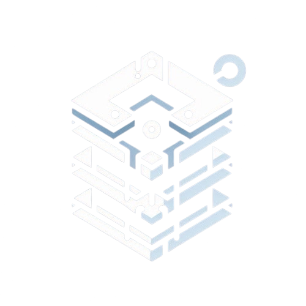

# CoreStruct - Interactive Data Structures Learning Platform



## 📚 Overview

CoreStruct is an interactive web-based platform designed to teach fundamental data structures through hands-on learning experiences. Built with HTML, CSS, and JavaScript, this educational tool provides a visual and interactive way to understand how different data structures work in programming.

## ✨ Features

### 🎯 Interactive Learning
- **Visual Demonstrations**: See data structures in action with real-time visualizations
- **Hands-on Practice**: Perform operations on data structures through interactive buttons
- **Immediate Feedback**: Get instant results and explanations for each operation

### 📊 Supported Data Structures

1. **Stack (LIFO)**
   - Push and Pop operations
   - Peek at top element
   - Check if empty
   - Get stack size
   - Clear stack

2. **Queue (FIFO)**
   - Enqueue and Dequeue operations
   - Peek at front element
   - Check if empty
   - Get queue size
   - Clear queue

3. **Linked List**
   - Insert at beginning/end
   - Delete nodes
   - Search for elements
   - Traverse the list
   - Display list structure

4. **Array**
   - Insert elements
   - Delete elements
   - Search operations
   - Sort functionality
   - Array manipulation

5. **Binary Tree**
   - Insert nodes
   - Delete nodes
   - Search operations
   - Multiple traversal methods:
     - In-Order Traversal
     - Pre-Order Traversal
     - Post-Order Traversal
     - Level-Order Traversal

### 🎨 Modern UI/UX
- **Responsive Design**: Works seamlessly on desktop, tablet, and mobile devices
- **Dark Theme**: Easy on the eyes with a modern dark color scheme
- **Smooth Animations**: Hover effects and transitions for better user experience
- **Intuitive Navigation**: Clean and organized navigation structure

## 🚀 Getting Started

### Prerequisites
- A modern web browser (Chrome, Firefox, Safari, Edge)
- No additional software installation required

### Installation

1. **Clone the repository**
   ```bash
   git clone https://github.com/yourusername/CoreStruct.git
   cd CoreStruct
   ```

2. **Open in your browser**
   - Simply open `index.html` in your web browser
   - Or use a local server for the best experience:
     ```bash
     # Using Python 3
     python -m http.server 8000
     
     # Using Node.js (if you have http-server installed)
     npx http-server
     
     # Using PHP
     php -S localhost:8000
     ```

3. **Start Learning**
   - Navigate to any data structure page from the main menu
   - Click on operation buttons to see how data structures work
   - Experiment with different operations to understand the concepts

## 📁 Project Structure

```
CoreStruct/
├── index.html              # Main landing page
├── stack.html              # Stack data structure page
├── queue.html              # Queue data structure page
├── linkedlist.html         # Linked List data structure page
├── array.html              # Array data structure page
├── binarytree.html         # Binary Tree data structure page
├── media/
│   └── logo.png           # Project logo
├── scripts/
│   ├── sapp.js            # Stack implementation
│   ├── qapp.js            # Queue implementation
│   ├── llapp.js           # Linked List implementation
│   ├── aapp.js            # Array implementation
│   └── bapp.js            # Binary Tree implementation
└── style/
    └── style.css          # Main stylesheet
```

## 🛠️ Technology Stack

- **Frontend**: HTML5, CSS3, JavaScript (ES6+)
- **Styling**: Custom CSS with modern design principles
- **No Dependencies**: Pure vanilla JavaScript implementation
- **Responsive**: Mobile-first responsive design

## 📖 How to Use

### Learning Path
1. **Start with the Basics**: Begin with Arrays and Stacks
2. **Progress to Linear Structures**: Move on to Queues and Linked Lists
3. **Advanced Concepts**: Explore Binary Trees and complex operations

### Interactive Features
- **Operation Buttons**: Click to perform specific operations
- **Visual Feedback**: See the data structure update in real-time
- **Error Handling**: Get alerts for invalid operations
- **State Management**: Track the current state of each data structure

### Example Usage
1. Navigate to the Stack page
2. Click "Push to Stack" and enter a value
3. Observe how the stack grows
4. Try "Pop from Stack" to see LIFO behavior
5. Use "Peek at Top" to view the top element without removing it

## 🎯 Educational Value

### Learning Objectives
- Understand fundamental data structure concepts
- Learn time and space complexity of operations
- Practice implementing common algorithms
- Develop problem-solving skills

### Target Audience
- Computer Science students
- Programming beginners
- Self-learners interested in algorithms
- Educators teaching data structures

## 🤝 Contributing

We welcome contributions to improve CoreStruct! Here's how you can help:

### Ways to Contribute
1. **Add New Data Structures**: Implement additional data structures (e.g., Hash Tables, Graphs)
2. **Improve Visualizations**: Enhance the visual representation of operations
3. **Add Algorithms**: Implement sorting and searching algorithms
4. **Enhance UI/UX**: Improve the user interface and experience
5. **Fix Bugs**: Report and fix any issues you encounter
6. **Documentation**: Improve documentation and add tutorials

### Contribution Guidelines
1. Fork the repository
2. Create a feature branch (`git checkout -b feature/AmazingFeature`)
3. Commit your changes (`git commit -m 'Add some AmazingFeature'`)
4. Push to the branch (`git push origin feature/AmazingFeature`)
5. Open a Pull Request

### Code Style
- Follow existing code formatting
- Add comments for complex logic
- Ensure responsive design compatibility
- Test across different browsers

## 🐛 Bug Reports

If you find a bug or have a suggestion, please:
1. Check existing issues to avoid duplicates
2. Create a new issue with a clear description
3. Include steps to reproduce the problem
4. Specify your browser and operating system

## 📄 License

This project is licensed under the MIT License - see the [LICENSE](LICENSE) file for details.

## 🙏 Acknowledgments

- Inspired by the need for better data structure education tools
- Built with modern web technologies for accessibility
- Designed for interactive learning experiences

## 📞 Contact

- **Project Link**: [https://github.com/yourusername/CoreStruct](https://github.com/yourusername/CoreStruct)
- **Issues**: [GitHub Issues](https://github.com/yourusername/CoreStruct/issues)

## 🔮 Future Enhancements

- [ ] Add more data structures (Hash Tables, Graphs, Heaps)
- [ ] Implement algorithm visualizations
- [ ] Add coding challenges and exercises
- [ ] Create a progress tracking system
- [ ] Add multiple language support
- [ ] Implement save/load functionality for user progress

---

**Happy Learning! 🎓**

*CoreStruct - Making Data Structures Accessible and Interactive* 